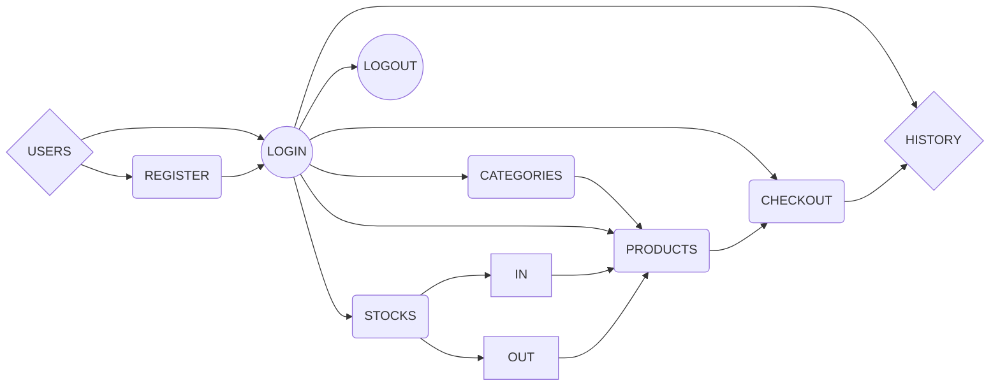

## Introduction

POS-RESTfulAPI is a Point of Sale systems with restful api. The main features are:

- Login and Register with JWT.
- User, Categories and Products database.
- Stock management ( Stock In & Out )
- CURD User, Products, Categories and Stock.
- Add/Reduce Products Order
- File Image Upload on product.
- Search product by name.
- Sort product by name, category, date updated.
- Products page pagination
- Allowed CORS
- Reporting on income today, yearly, and orders weekly.

The POS-RESTfulAPI is written in Node Js with Express framework, it uses MySQL as data storage back-end and has a simple but intuitive user interface.

## Flowchart



## How to Install

- Please make sure that you have : node.js installed ([https://nodejs.org/](https://nodejs.org/))
- Download or clone this file and then config & import MySQL database.
- You can use [POSTMAN](https://www.getpostman.com/) or anything else for simulate.
- The app loads the environment variable by reading `.env` file in the root directory of the project. Create `.env` file with environment variable in line with following:
  `SERVER_PORT = 1000 DB_HOST = "localhost" DB_USER = "your-user" DB_PASS = "your-password" DB_NAME = "your-database" PRIVATE_KEY = "your-private-key" URL = "http://localhost:1000/"`

## API Versioning

The first part of the URI path specifies the API version you wish to access in the format `v{version_number}`.

For example, version 1 of the API (most current) is accessible via:

```
https://localhost:1000/api/v1/
```

## List of Endpoints

**USERS**

- [GET] /api/v1/users
  Get all users

- [GET] /api/v1/users/:id
  Get user detail

- [PATCH] /api/v1/users/:id {name, email, password}
  Update user data

- [DELETE] /v1/users/:id
  Delete user

- [POST] /api/v1/users {name, email, password}
  Insert user

- [POST] /api/v1/users/login {email, password}
  Login user

- [POST] /api/v1/users/logout
  Logout user

**CATEGORIES**

- [GET] /api/v1/categories
  Get all categories

- [GET] /api/v1/categories/:id
  Get categories detail

- [PATCH] /api/v1/categories/:id {name}
  Update categories data

- [DELETE] /v1/categories/:id
  Delete categories

- [POST] /api/v1/categories {name}
  Insert categories

**PRODUCTS**

- [GET] /api/v1/products
  Get all products

- [GET] /api/v1/products/:id
  Get products detail

- [PATCH] /api/v1/products/:id {name, description, image, price, category_id}
  Update products data

- [DELETE] /v1/products/:id
  Delete products

- [POST] /api/v1/products {name, email, password}
  Insert products

- [GET] /api/v1/products/search/:name
  Search products by name

- [GET] /api/v1/products/sort/:sort {name, description, image, price, category_id}
  Sort products by name, category, last_update

- [GET] /api/v1/products/page/:page
  Get products list with pagination

**STOCKS**

- [GET] /api/v1/stocks
  Get all stocks

- [PATCH] /api/v1/stocks/:id {product_id, type, qty, description}
  Update stocks data

- [DELETE] /v1/stocks/:id
  Delete stocks

- [POST] /api/v1/stocks {product_id, type, qty, description}
  Insert stocks

**CHECKOUT**

- [GET] /api/v1/checkout
  Get all checkout

- [GET] /api/v1/checkout/cart
  Get checkout from user login

- [POST] /api/v1/checkout {order_number}
  Insert checkout

- [POST] /api/v1/checkout/cart {order_id, product_id, qty}
  Insert product to checkout cart

**HISTORY**

- [GET] /api/v1/history
  Get reporting on income today, yearly, and orders weekly
